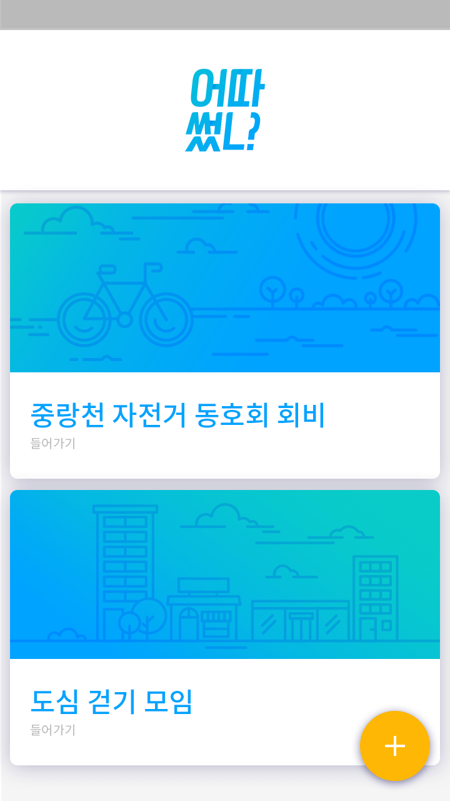
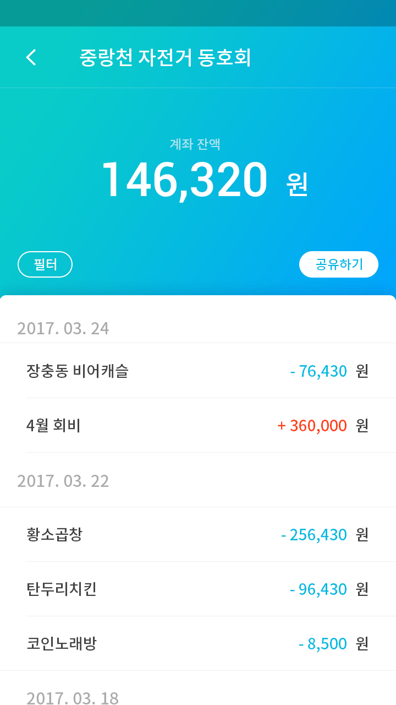

# BankShare

Project for the NH-KISA Fintech Hackathon (2017)

## 1. Introduction
An app that allows an account owner to share transaction history with other people. Fetches account history through the [NH Fintech API](https://nhfintech.nonghyup.com/svcportal/home/html/main.html), then shares a subset of that information through a URL that can be viewed in-browser.

## 2. Screenshots

  
  

